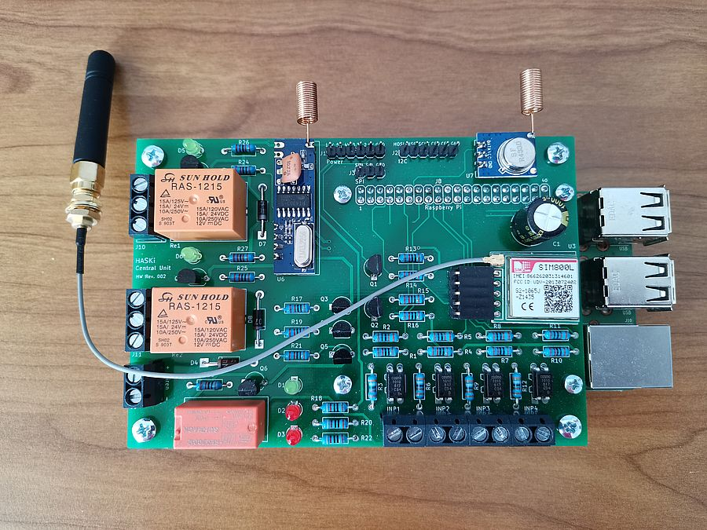

# Home Automation and Security System

Home Automation and Security System is a DIY project based on Home Automation Starter Kit (HASKi) hardware. It serves as a reference project which can be further enhanced, modified and improved.

The complete description is available on [the project page](https://www.volt-bit-projects.com/articles/21/).

Step by step tutorial how to build HASKi hardware is available on the [project page](https://www.volt-bit-projects.com/articles/15/).
